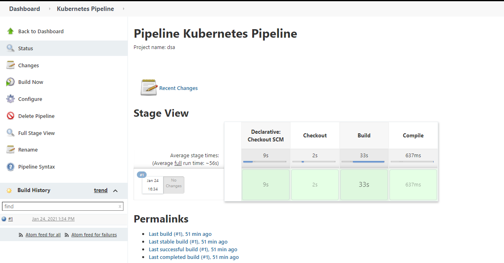
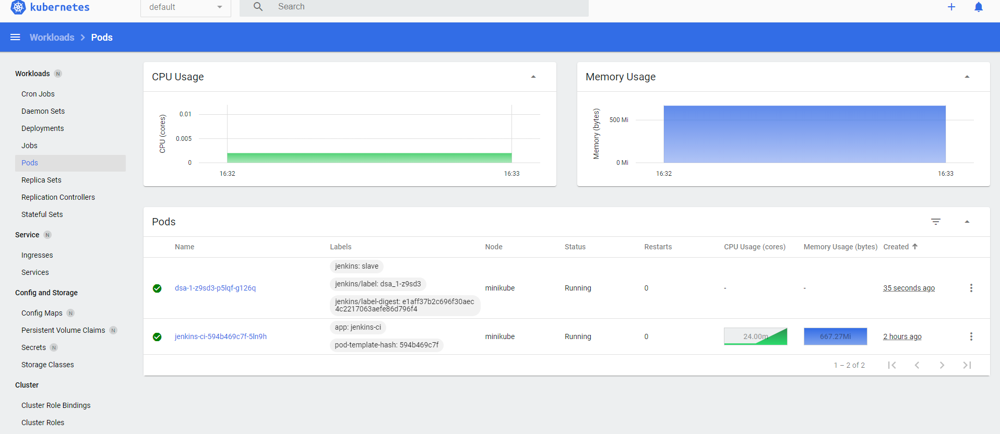
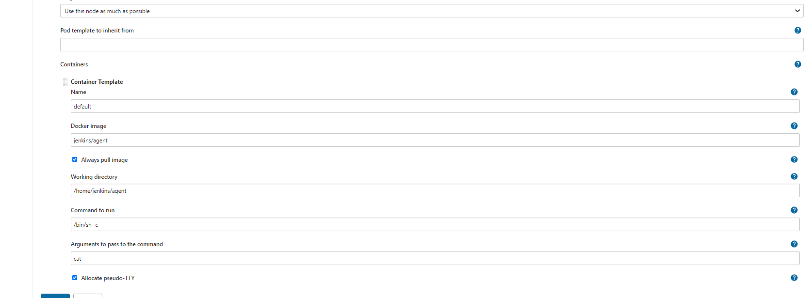
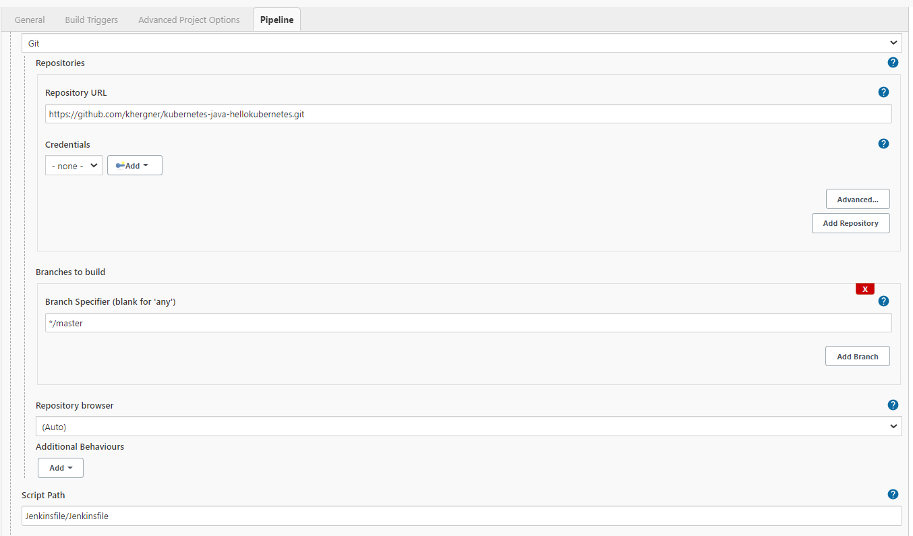

# Scale Jenkins with Kubernetes 

Jenkins is the most popular open source continuos integration and continuos delivery tool in the DevOps operation.



**You have to create dockerfile for Master server**

```
If you would like to install build stage, you can use the plugin file
cd jenkins-server
sh create-push.sh
```

**You have to create dockerfile for Slave pod**

```
cd jenkins-agent\java-maven or jenkins-agent\java-maven-node
sh create-push.sh
```

First step 

> minikube addons enable metrics



if you want to create pod, you can use the below command 

>kubectl create -f pv.yaml

>kubectl create -f pvc.yaml

>kubectl create -f account.yaml

>kubectl create -f deployment.yaml

>kubectl create -f ingress.yaml

>kubectl create -f service.yaml

OR

```
cd source
kubectl create -f .
```
it's ready to deploy! :point_down:

**Configuration**

>Manage -> Configure System -> Cloud -> Kubernetes

>Kubernetes Url = kubectl cluster-info | grep master

>Jenkin Url = Master pod ip:8080

>Credentials = you can use kubernetes service account object

>Pod Template=  you can configuration as below image



**Jenkins create New Project**

>You can use freestyle or pipeline, in the example below ı used freestyle template

```
git clone https://github.com/khergner/kubernetes-java-hellokubernetes.git
```

- [x] mvn clean install
- [x] java -jar target/hello-kubernetes-1.0.0.jar



*If you want to use declarative syntax*

```
pipeline {
    agent {
        kubernetes {
            yaml '''
               apiVersion: v1
               kind: Pod
               spec:
                 containers:
                 - name: shell
                   image: kherguner/jenkins-slave-java-maven:3.6.3
                   command:
                   - sleep
                   args:
                   - infinity
               '''
            defaultContainer 'shell'
        }
    }
   stages {
      stage('Checkout') {
         steps {
            script {
               git url: 'https://github.com/khergner/kubernetes-java-hellokubernetes.git'
            }
         }
      }
      stage('Build') {
         steps {
            sh 'mvn clean install'
         }
      }
	  stage('Compile') {
         steps {
            sh ' java -jar target/hello-kubernetes-1.0.0.jar'
         }
      }
	}
}
```

**How can ı generate url**
- [x] minikube ip | jenkins.k8s.test --> "C:\Windows\System32\drivers\etc\hosts"

You can see dashboard via browser @octocat :+1:


## About

My profile **[Korhan Herguner](https://www.linkedin.com/in/korhan-herguner/)**.

- <https://www.linkedin.com/in/korhan-herguner/>
- <https://medium.com/@korhanherguner>
- <https://github.com/khergner>
